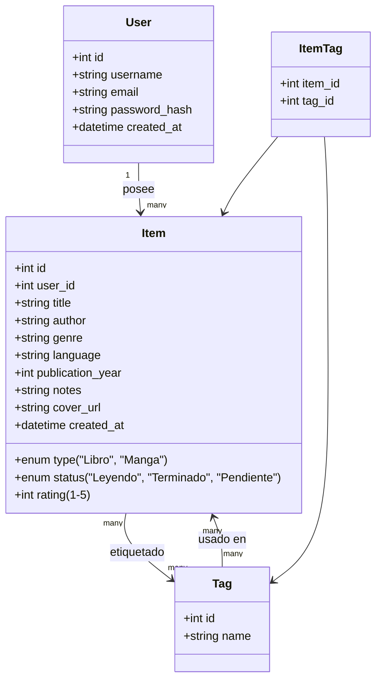

# Modelo de datos

```mermaid
classDiagram
    class User {
        +int id
        +string username
        +string email
        +string password_hash
        +datetime created_at
    }

    class Item {
        +int id
        +int user_id
        +string title
        +string author
        +enum type ("Libro", "Manga")
        +string genre
        +string language
        +int publication_year
        +enum status ("Leyendo", "Terminado", "Pendiente")
        +int rating (1-5)
        +string notes
        +string cover_url
        +datetime created_at
    }

    class Tag {
        +int id
        +string name
    }

    class ItemTag {
        +int item_id
        +int tag_id
    }

    User "1" --> "many" Item : posee
    Item "many" --> "many" Tag : etiquetado
    Tag "many" --> "many" Item : usado en
    ItemTag --> Item
    ItemTag --> Tag
```
