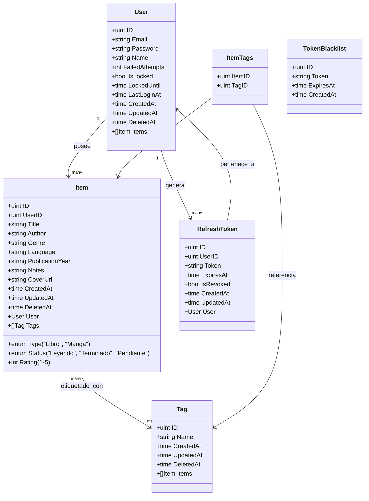

# Modelo de datos

## Características del modelo actualizado

### 🔐 Seguridad mejorada
- **Control de acceso**: Sistema de bloqueo temporal de cuentas
- **Refresh tokens**: Gestión segura de sesiones prolongadas  
- **Token blacklisting**: Revocación explícita de tokens
- **Rate limiting**: Protección contra ataques de fuerza bruta

### 📊 Estructura de datos
- **Soft deletes**: Eliminación lógica con `DeletedAt`
- **Timestamps automáticos**: `CreatedAt`, `UpdatedAt` en todas las entidades
- **Relaciones GORM**: Asociaciones many-to-many optimizadas
- **Campos de seguridad**: Seguimiento de intentos fallidos y bloqueos

### 🏷️ Sistema de etiquetado
- **Tags flexibles**: Sistema de etiquetado many-to-many
- **Asociaciones GORM**: Manejo automático de relaciones
- **Prevención de duplicados**: Lógica mejorada para evitar tags duplicadas
