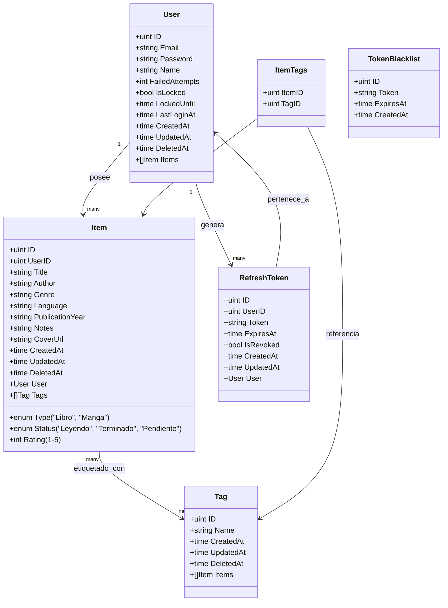

# PERSONAL BOOKSHELF

Una aplicación para gestionar tu colección personal de libros y mangas.

## Modelo de datos



## Como correr la aplicación

Para correr la aplicación mediante Docker, sigue estos pasos:

1. Asegúrate de tener Docker y Docker Compose instalados en tu máquina.
2. Clona este repositorio en tu máquina local.
3. Navega al directorio del proyecto.
4. Ejecuta el siguiente comando para construir y correr los contenedores:

   ```bash
   docker-compose up --build
   ```
5. La aplicación estará disponible en `http://localhost:8080`.
6. Para registrar un nuevo usuario, envía una solicitud POST a `http://localhost:8080/api/register` con los datos necesarios.

    ```bash
    curl --request POST \
        --url http://localhost:8080/api/register \
        --header 'Content-Type: application/json' \
        --data '{
            "email": "user@gmail.com",
            "password": "MiPassword123!",
            "name": "User User"
        }'
    ```
7. Inicia sesión en la aplicación web con las credenciales que acabas de crear.

## Documentación de la API

Para ver la documentación completa de la API, revisa el siguiente documento: [API Documentation](API_DOCUMENTATION.md)

## Tecnologías utilizadas

- Go
- Gin Gonic
- GORM
- sqlite

## Pendientes de implementar 

- Uso del token de refresco para renovar tokens JWT desde la aplicación web.
- Implementar tests unitarios y de integración.
- Mejorar la validación de datos de entrada.
- Añadir paginación y filtros a los endpoints de la API.
- Refactor de app hacia arquitectura hexagonal.


